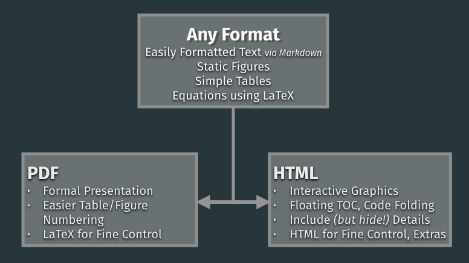
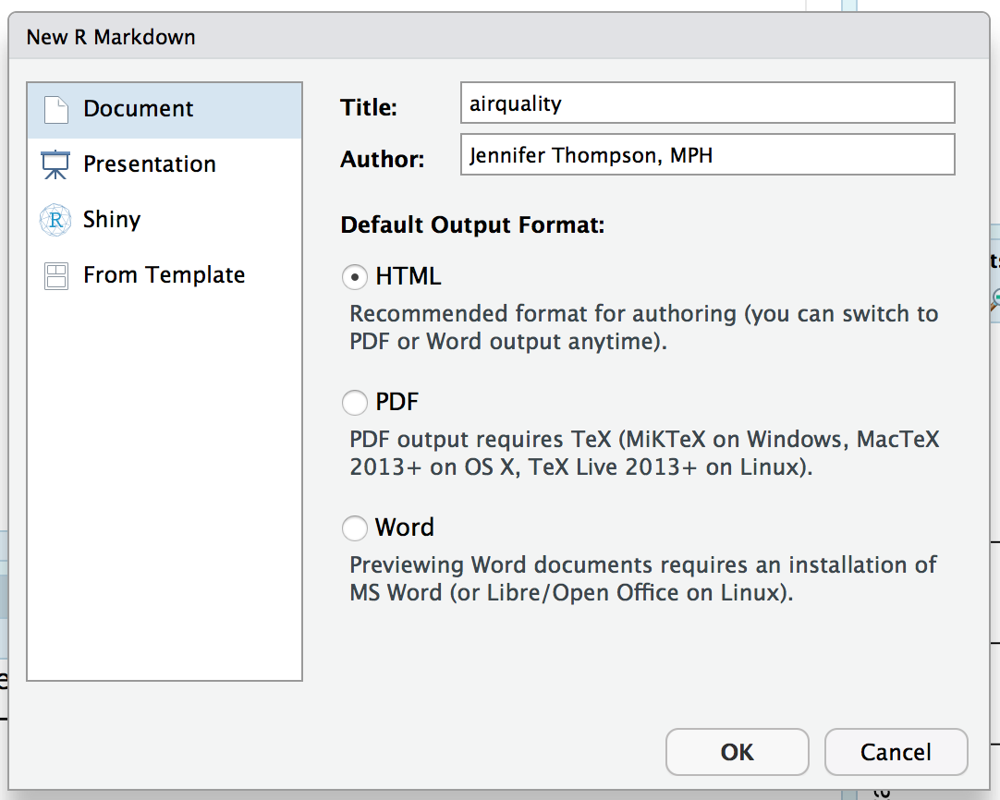
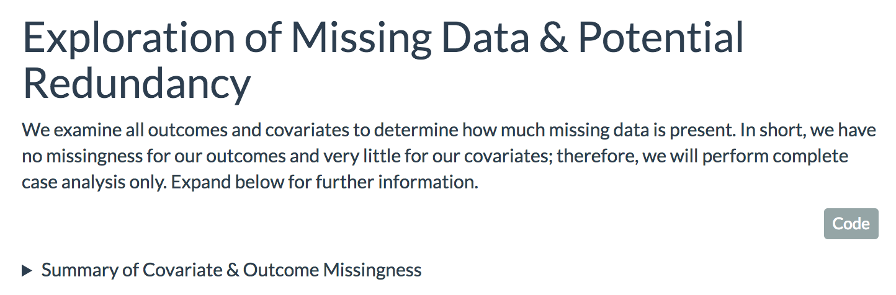
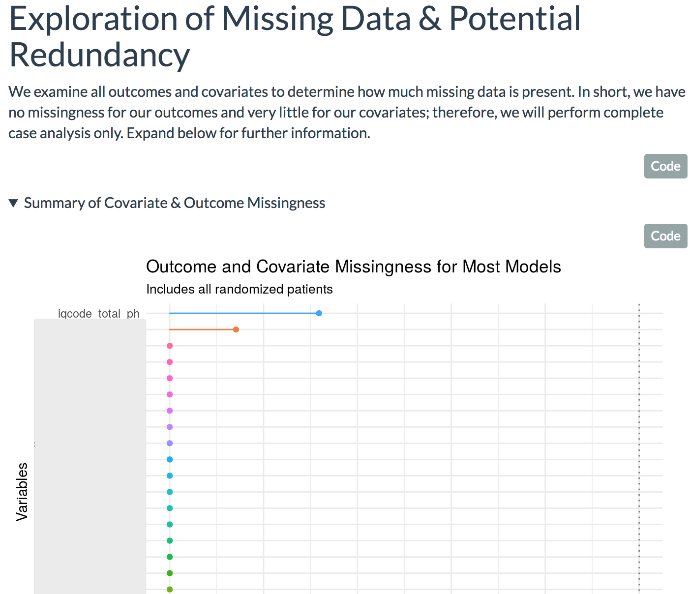
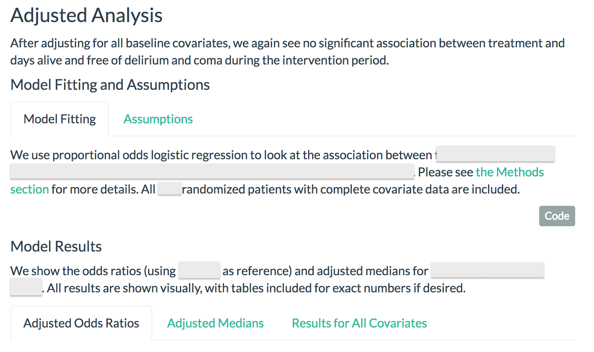
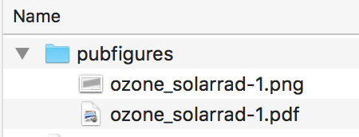
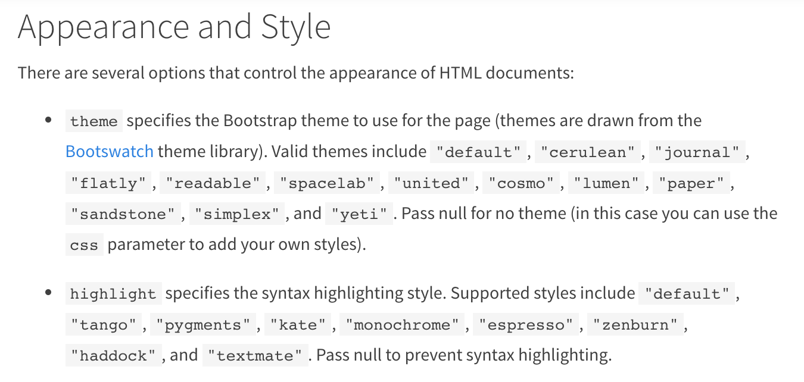
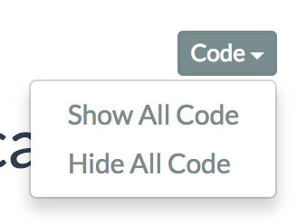
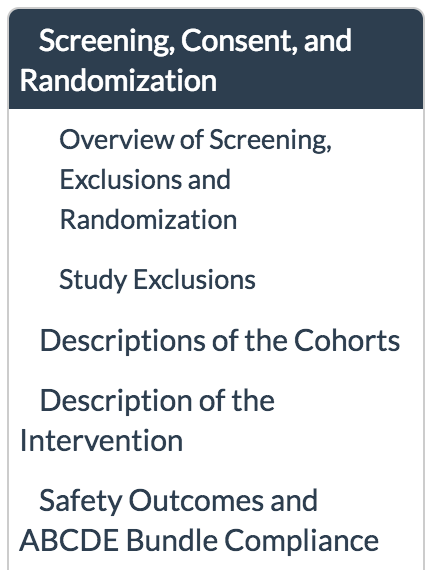

```{r set_this_up, include=FALSE}
knitr::opts_chunk$set(echo = TRUE, cache = FALSE)
knitr::knit_engines$set("yaml")

library(knitr)
library(kableExtra)
library(magrittr)
library(plotly)
library(ggplot2)

```

class: inverse, middle

# Summary & Goals

RMarkdown allows you to do modern reproducible research with powerful features, particularly in the HTML format.

--

After today, you will:

- Understand Markdown syntax
- Know how to create reproducible research documents in PDF and HTML format using RMarkdown
- Be aware of additional packages that can help your reports be more informative
- Have a list of resources to help you learn even more going forward

---

class: center

## What is Reproducible Research?

You perform analysis in 2014; in 2016, the primary investigator is ready to write the paper. She asks you for new figures, and has another year of data she wants to add.

--

<hr>

You submit a paper, and it takes several months to get feedback from reviewers. When you receive it, they have requested additional analyses and changes to figures.

--

<hr>

You got a promotion 🎊, and need to send your code to the coworker who will take over your projects.

---

.pull-left[
  ## Scenario 1
  
  - Your code wasn't saved, or was saved in a mystery location
  - You used several scripts
  - You saved your code, but
      - The output was copied & pasted into Word
      - The figures were done separately, in Excel or SPSS *(which are very fine tools!)*
  
  ## Result: 💔
]
--
.pull-right[
  ## Scenario 2
  
  - Your code was saved in a sensible, accessible location, in a single file
  - Original tables and figures were generated by the same script that did the calculations
  - Old and new data are in similar formats
  
  ## Result: 😊
]

---

# How can we achieve 😊?

Using **reproducible research strategies**, we can create and store all code and data needed to recreate our analysis results.

--

This might involve:

- No point and click: Code scripts for everything!
- Sensible file storage structures
- Analysis, table generation, and figure generation all done together
- Code is well documented

We'll discuss each of these in more detail!

---

# Point & Click vs Scripted Code

.pull-left[
  ### Point & Click
  #### (Excel, SPSS, or R without saving it)
  
  - Relies on memory and your notes to know for certain what you did
  - No way to know for certain what went wrong if you get different numbers
  - Worst of all: If anything changes, you have to do it *all over again*
  
  ## Result: 💔
]
--
.pull-right[
  ### Scripted, Saved Code
  
  - Every step you took is saved in a script (or several)
  - Tables and figures can be regenerated using the same script and data
  - Updating with new data is usually straightforward
  
  ## Result: 😊
]

---

# Sensible File Structures

**Key points**: Make it easy to both keep yourself organized and allow someone else to use your code without changing all the file paths or searching for the right data.

😢: When `Project 2` needs `C:\My Documents\Jennifer\Project1Data\spreadsheet1.xlsx`

--

## Example File Structure

.pull-left[

```
ParentStudy \
  analysisdata \
  Project1 \
    analysisdata \
    proj1_analysis.Rmd
  Project2 \
    helperscripts \
    proj2_analysis.Rmd
```

]

.pull-right[

```
eg, "OurRCT"
  Analysis datasets from OurRCT
  Subfolder, Project 1
    Additional data only for Project 1
    Analysis script for Project 1
  Subfolder, Project 2
    R scripts only used in Project 2
    Analysis script for Project 2
```

]

For someone else to take over Project 2, everything they need will be in the `Project2` folder and `analysisdata/`.

--

For more, see [Jenny Bryan's excellent blog post on project-oriented workflow](https://www.tidyverse.org/articles/2017/12/workflow-vs-script/).

---

# Analysis, tables, figures done together

## Ideal

All data management, analysis, and figure generation done in a single script

--

- Easier to know which code produced which result, because it's all together
- No confusing "v2" with "v3", or "submitted" with "resubmitted"

--

### Reasonable exceptions (not exhaustive)

- Large projects with lots of data management required (this is the reason for the `analysisdata/` directory on the last slide!)
- Separate scripts of helper functions (eg, yesterday's data monitoring tutorial) - often easier to maintain and debug these in a separate script

    If you have many helper functions, you could even consider creating an R package for your project!

---

# Code Documentation

## Literate Programming

Have you ever...

- Opened an R script you wrote six months ago and realized you have no idea what it does?
- Taken over a project from someone else and spent days trying to figure out what *their* script was doing?

--

"You are always working with at least one collaborator: Future you." - Hadley Wickham

---

# Code Documentation

## Literate Programming

Literate programming is a technique for mixing written text and chunks of code together.

This can allow for easier documentation of code, **and/or** the production of a full written report that incorporates the code and results used to create it.

--

> Let us change our traditional attitude to the construction of programs: Instead of imagining that our main task is to instruct a computer what to do, let us concentrate rather on explaining to humans what we want the computer to do.
>
> — Donald E. Knuth, Literate Programming, 1984

---

# How are these related?

There are several tools in R which allow us to accomplish both of these last two goals.

--
- [Sweave](http://stat.ethz.ch/R-manual/R-devel/library/utils/doc/Sweave.pdf): The original method for literate programming in R, which allows the creation of complete research documents in PDF format by combining R and LaTeX

--
- [knitr](https://cran.r-project.org/package=knitr): Newer package for literate programming which builds on Sweave, but has more flexibility

--
- [RMarkdown](http://rmarkdown.rstudio.com/): Powerful package for literate programming, reproducible analysis, and document generation, which can (often working with `knitr`):
    - Combine R code and **Markdown** syntax
    - Produce documents in not only PDF format, but Microsoft Word and various types of HTML documents *(like these slides!)*
    - In HTML format, incorporate "extras" like interactive graphics
    
---

# What is Markdown?

[Markdown](https://en.wikipedia.org/wiki/Markdown) is a lightweight markup language that allows you to quickly write and format text, which is then converted to different types of output.

--
.pull-left[
# Advantages

- Lightweight syntax: Less to learn/type than LaTeX or HTML
- Can do the vast majority of what you need with less effort
- Syntax resembles the finished product
]

--
.pull-right[
# Disadvantages

- Less control, fewer options than LaTeX or HTML

   *(...BUT you can also incorporate actual LaTeX or HTML if you need more control!)*
]

--
[Here's a tutorial!](https://www.markdowntutorial.com/)

---

# Markdown Syntax

We want to write a paragraph where we **bold** some words, put some in *italics* and some in `verbatim`, include a

## Main Header
### And a Subheader

- bulleted
- list
    - with a
    - sublist,
    
and an

1. enumerated list
1. with a random number inserted, like `r round(runif(n = 1), 2)`

> and a quote, like this

---

# LaTeX (Sweave/knitr Rnw file) Version

```
We want to write a paragraph where we \textbf{bold} some words, put some in
\emph{italics} and some in \texttt{verbatim}, include a

\section{Main Header}
\subsection{And Section Header}

\begin{itemize}
\item bulleted
\item list
  \begin{itemize}
    \item with a
    \item sublist,
  \end{itemize}
\end{itemize}
    
and an

\begin{enumerate}
\item enumerated list
\item with a random number like \Sexpr{round(runif(n = 1), 2)}
\end{enumerate}

\quote and a quote, like this

```

---

# Markdown Version

``` 
We want to write a paragraph where we **bold** some words, put some in *italics*
and some in `verbatim`, include a

## Main Header
### And a Subheader

- bulleted
- list
    - with a
    - sublist,

and an

1. enumerated list
1. with a random number inserted, like `r "\u0060r round(runif(n = 1), 2)\u0060"`

> and a quote, like this

```

---

# Your Turn!

1. Make sure you have the RMarkdown package installed and have run `library(rmarkdown)` in your R session
1. Open a new text file, write some text describing a project you're working on, and format it however you like using Markdown syntax
1. Save your file with the extension `.md` (for Markdown)
1. Use RMarkdown's `render()` function to create an HTML file:

`rmarkdown::render("myfile.md")`

For more help with syntax, also see:

`https://daringfireball.net/projects/markdown/syntax`

---

# R + Markdown

## Input

RMarkdown files combine **R code chunks** with **text formatted in Markdown**, and are always saved with the `.Rmd` extension (eg, `analysis.Rmd`).

You can also include "inline" R code that is not in a specific chunk.

````
For example, here is text before an R code chunk where I generate a
random sample from a normal distribution.

```{r my_code}
my_sample <- rnorm(n = 100)

```

Then later, I want to refer to the mean, which is `r
mean(my_sample)`.

````

---

# RMarkdown Output

Some options:

- PDF
- Microsoft Word
- [Beamer presentations](https://rmarkdown.rstudio.com/beamer_presentation_format.html)

--
- **HTML documents**
    - Standalone documents, in [notebook mode](https://rmarkdown.rstudio.com/r_notebooks.html) or not *(today's focus!)*
    - [Flexdashboards](https://rmarkdown.rstudio.com/flexdashboard/)
    - [xaringan]() slides like this!

--

You can create multiple types of output with the same `.Rmd` file:

`rmarkdown::render(input = "analysis.Rmd", output = "pdf_document")`
`rmarkdown::render(input = "analysis.Rmd", output = "word_document")`

---

# RMarkdown Document Format

1. YAML

--

1. Markdown text
1. R code

--

1. Repeat 2 & 3 as needed

*Sweave users: RMarkdown and knitr documents work very similarly to Sweave, but with slightly different syntax and options for code chunks.*

---

# YAML
## (Yet Another Markup Language)

YAML is the "metadata" - the data about your document - that goes at the top of your file and tells RMarkdown things like titles and document options.

```{r, eval = FALSE}
---
title: "My Analysis Report"
author: "Jennifer Thompson, MPH"
date: "2018-06-05"
output: pdf_document #<<
---
```

--

This is the *minimum* YAML most RMarkdown documents will have, but you can specify many other options depending on the output format you use. Examples to come!

???

The output line sets the **default** output format for this document.

If we specify a format here, we don't have to specify it in the render() function.

Or, we can specify the default format here, but use render() to create output of a different format - maybe we usually want to create a PDF, but at the end we also create a Word document to make writing a manuscript easier.

---

# Your Turn!

1. Open the test Markdown file you just created, and add some YAML to the top of the document.
    - You can specify whatever output format you like: `pdf_document`, `word_document`, `html_document` (or try them all!).
1. Render it again, using `rmarkdown::render("myfile.md")`.
1. Check to make sure you got the file output you requested.

🚨 **NOTE** 🚨: *Even though we are not using LaTeX for formatting, you will need to have a TeX installation on your computer if you want to create a PDF.*

--

1. BONUS: Leave the file YAML the same, but use `rmarkdown::render()`'s `output_format` option to specify a *different* output format than the one in your YAML.

--

`rmarkdown::render("myfile.md", output_format = "word_document")`

---

# Combining R + Markdown

RMarkdown documents are Markdown-formatted text, with "chunks" of R code placed where you need them. You designate an R code chunk using ``backticks ` `` and `braces { }`:

` ```{r chunk_name, [options]}` 

`    ## R code here`
    
`    ``` `

--

`options` include various things that you want to control for that particular chunk, including things like

- Figure height and width
- Whether to `echo` (show) or `evaluate` (run) that code chunk in the final document
- Whether to show warnings and messages

These are passed to `knitr`; you can see a full list of knitr options at [yihui.name/knitr/options/](https://yihui.name/knitr/options/).

---

# Your Turn!

1. Add a chunk of R code to your Markdown file that creates a basic scatterplot: `plot(1:10, 1:10)`.
1. Re-save the file with the `.Rmd` extension (because now it includes R *and* Markdown code).
1. Render the file.

--

1. BONUS: Change some options: Hide the code itself using `echo = FALSE`, and change the figure height and width using `fig.height` and `fig.width` *(remember that these are in inches)*.

Remember, you can find other options at `yihui.name/knitr/options`.

--

**Next**: Add another chunk that displays the first six rows of the `airquality` dataset, using the `results = "asis"` option.

---

# Tables

The `results = "asis"` option renders the output of our R code chunks "as is", meaning, as it is formatted within the R chunk. In this example, that doesn't work well!

`knitr::kable()` can help us with that. Try updating your R code chunk:

.pull-left[
### Before:

```{r no_formatting, echo = TRUE, results = "asis"}
head(iris[, 1:2])
```
]

.pull-right[
### After:

```{r formatted, echo = TRUE}
library(knitr)
kable(head(iris[, 1:2]))
```
]

---

# Simplicity vs Control

`knitr::kable()` is great for simple tables; it purposefully does not offer many features, to keep use simple.

--

This is also true of Markdown: It is **simple on purpose**, to keep from complicating your life and your code!

Simplicity saves time and allows us to focus on *content* rather than *formatting*.

--

<center>Markdown: <b>90% of the results from 10% of the effort.</b></center>

--

## But...

Sometimes we want something more complicated. We have to choose:

--

.pull-left[
### Simplicity
]

.pull-right[
### Control & Features
]

---

# Simplicity vs Control: Example

The [`kableExtra`]() package is an excellent add-on package for adding complexity to tables in either LaTeX or HTML. **But**: Some of its features are only available in HTML documents.

```{r fancy_table_demo, eval = FALSE}
kable(head(iris), format = "...") %>%
  group_rows("Group 1", 1, 3) %>%
  group_rows("Group 2", 4, 6) %>%
  add_header_above(c("Sepal" = 2, "Petal" = 2)) %>%
  ## HTML only
  # scroll_box(width = "250px", height = "200px") %>%
  # kable_styling(bootstrap_options = "hover")

```

.pull-left[

]

.pull-right[
```{r fancy_table, echo = FALSE}
kable(iris) %>%
  add_header_above(
    c("Sepal" = 2, "Petal" = 2, "Species" = 1)
  ) %>%
  scroll_box(
    width = "300px", height = "300px"
  ) %>%
  kable_styling(bootstrap_options = "hover")

```

]

--

Once we choose one format, our document will no longer render properly in another format.

---

# Simplicity vs Control


.pull-left[

## Simplicity

- Very **little time** spent formatting
- One `.Rmd` file can create **multiple types** of output with ease
- **Limited** in what you can display

### Choose If
Little time, simple document, will create in multiple formats

]

--

.pull-right[

## Control/Features

- Nicer-looking, **more informative** end product
- Have to **choose** output format ahead of time
- **More time** spent formatting

### Choose If

Only need one version, as clear & informative as possible

]

---

# Choosing a Format

So far, everything has translated equally well into a PDF, Word, or an HTML document. But when we choose **control** we give up that flexibility!

So how do you choose a format?

--



---

# The Power of HTML

- Interactive graphics
- Ability to include HTML, written by me (rare) or others (often)
- Floating table of contents
- Include code, without taking up visual space
- Include details, without taking up visual space
- Tabsets
- Make it look pretty easily

---

# Case Study with `airquality`

For the rest of our workshop, we'll be using the `airquality` dataset.

*(Find out more about this dataset by typing `?airquality` in your R session.)*

.pull-left[
```{r head_aq}
head(airquality)

```
]
--
.pull-right[
### To Do List:

1. Quickly summarize, explore dataset
1. Use a linear model to predict ozone levels in New York
1. Check model assumptions
1. Produce nice table, publication-quality figure of model results
1. Cite software, packages used
]

---

# Your Turn!

.pull-left[
## Using RStudio

1. `File -> New File...`
1. Leave `Document`, `HTML` checked
1. Add your title, save as `airquality.Rmd`



]

.pull-right[
## Without RStudio

Open a new file and insert this YAML, then save as `airquality.Rmd`:

    ---
    title: "airquality"
    author: "Your Name"
    date: "2018-06-05"
    output: html_document
    ---
]

---

# Setup Chunk

In my first R code chunk, I typically include any `knitr` options I want to set throughout the document and load all the libraries I need for analysis.

````
```{r setup, message = FALSE}
knitr::opts_chunk$set(echo = TRUE, message = FALSE, warning = FALSE)

library(knitr)
library(plotly)
library(magrittr)
library(kableExtra)

```
````
---

# Summarize & Explore Dataset

We want to explore our variables individually using histograms, and unadjusted relationships between each covariate and our outcome using scatterplots. While we could do this using static figures, interactive graphics could also be helpful.

We'll use the [`plotly`](https://plot.ly/r/) package to do both! `plotly` supports many types of interactive graphics, with the ability to

- Add information using tooltips
- Combine plots using "subplots"
- Zoom in to examine specific points
- And more!

`plotly` is built on JavaScript; Carson Sievert maintains the R package which allows us to use it within R. Its excellent documentation is at [`plot.ly/r`](https://plot.ly/r).

---

# Using `plotly` for Histograms

## Create a Single Plot

```{r ozone_hist, fig.width = 8, fig.height = 5}
## -- Create a single histogram for Ozone --------------------------------------
ozone_hist <- plot_ly(x = airquality[, "Ozone"], type = "histogram")

ozone_hist

```

---

# Using `plotly` for Histograms

1. Create a `list` of all our histograms
1. Combine them using `subplot`s in `plotly`

```{r create_histograms}
## Setup: Character vectors of variable names and hex colors
aq_vars <- c("Ozone", "Solar.R", "Wind", "Temp")
aq_cols <- c(
  "Ozone" = "#88706c", "Solar.R" = "#84886c",
  "Wind" = "#6c8488", "Temp" = "#706c88"
)

## Use lapply() to create a **list** of histograms
hist_list <- lapply(aq_vars,       ## For each outcome/covariate,
  FUN = function(xvar){
    plot_ly(                       ## Create a plotly object...
      x = airquality[, xvar],      ## ...with [variable] on X axis
      type = "histogram",          ## Plot is a histogram
      color = I(aq_cols[[xvar]]),  ## Use this hex color for this variable
      name = xvar                  ## name of "trace" (shows in legend)
    ) %>%                          #<<
      ## Add variable name to X axis title
      layout(xaxis = list(title = xvar))
  }
)

```

---

# Using `plotly` for Histograms

```{r combine_histograms}
## Combine **all** the plots into one using plotly::subplot()
aq_histograms <- subplot(
  hist_list,                        ## List of histograms we just created
  nrows = 2,                        ## Rows our final object has
  shareY = TRUE,                    ## Plots on same row should share a Y axis
  titleX = TRUE,                    ## Keep individual X axis titles
  margin = c(0.05, 0.05, 0.05, 0.1) ## Plot margins
)

```

---

# Using `plotly` for Histograms

```{r print_histograms, echo = FALSE, fig.width = 10, fig.height = 7}
aq_histograms

```

---

# Your Turn!

1. Add an introductory paragraph to your `airquality.Rmd` file with a brief description of the study.
1. Using a Markdown header, add a section for data exploration.
1. Add a `plotly` histogram of one of the variables in `airquality` to your document.

---

# Bivariate Relationships

We can explore relationships between our outcome, `Ozone`, and the other covariates in our model by adding `traces` (layers) to our `plotly` plots.

```{r bivariate_single}
ozone_scatter <- plot_ly(
  ## First trace: temperature vs ozone
  x = airquality[, "Temp"], y = airquality[, "Ozone"],
  type = "scatter",             ## Scatterplot
  name = "Temperature",         ## Name for legend,
  color = I(aq_cols[["Temp"]]), ## color (same as above)
  alpha = 0.6,                  ## make points 60% opacity (1.0 = opaque)
  marker = list(size = 15)      ## make points larger for presentation
) %>%
  ## Add traces for Solar.R, Wind
  ##   add_trace "inherits" anything we don't specify - use the same Y axis, eg
  add_trace(
    x = airquality[, "Solar.R"],
    name = "Solar Radiation",
    color = I(aq_cols[["Solar.R"]])
  ) %>%
  add_trace(
    x = airquality[, "Wind"], name = "Wind", color = I(aq_cols[["Wind"]])
  ) %>%
  layout(yaxis = list(title = "Ozone"))

```

---

# Bivariate Relationships

```{r print_bivariate, fig.width = 10, fig.height = 7}
ozone_scatter

```

---

# Other Ways to Include Interactivity

There are several R packages for interactive graphics when using HTML output. They include:

- [`plotly`](https://plot.ly/r)
- [`highcharter`](http://jkunst.com/highcharter/)
- [`ggiraph`](https://cran.r-project.org/package=ggiraph), for `ggplot2` objects
- [`leaflet`](http://rstudio.github.io/leaflet/) for maps
- More!

The [`htmlwidgets`](https://www.htmlwidgets.org/) site includes many other examples.

---

# Inline R Code

Like Sweave, RMarkdown can include **inline code**: R code outside of code chunks. The syntax is slightly different:

.pull-left[
### Sweave

`\Sexpr([expression])`
]

.pull-right[
### RMarkdown

`` `r
expression` ``

]

--

## Your Turn!

To your `airquality.Rmd` file, add a paragraph using inline R code to describe how many observations will be excluded from our analysis due to missing data.

---

# HTML Features

This section will demonstrate some of my favorite HTML features for statistical reports:

- Hiding sections using details
- Combining related information using tabset
- Sparklines

Demo time! *using other HTML reports*

---

# How To: Details

    <details>
    <summary>Optional summary of your details section</summary>
    ...
    </details>

--

.pull-left[

]

.pull-right[

]

---

# How To: Tabset

- Helpful for multiple pieces of related information
    - Models of same outcome (eg, mortality) at different time points
    - Several types of results for same model

.pull-left[

]

.pull-right[

    ## 
    ### Big Section{.tabset}
    
    #### Subsection 1

    Info, code chunks for subsection 1
    
    #### Subsection 2
    
    Info, code chunks for subsection 2

]

---

# Your Turn!

Fit a linear model predicting ozone using solar radiation, wind, and temperature. Then,

1. Visually check model assumptions using residual vs fitted and Q-Q plots
1. Collapse the plots in a Details section, with each in a separate tabset

```{r demo_model}
mymod <- lm(Ozone ~ Solar.R + Wind + Temp, data = airquality)

```

.pull-left[
```{r rp, fig.height = 5}
plot(resid(mymod) ~ fitted(mymod))
```
]

.pull-right[
```{r qq, fig.height = 5}
qqnorm(resid(mymod))
```
]

---

# We Should Fix That

Let's log transform our outcome and re-check our assumptions:

```{r demo_model_log, fig.width = 9, fig.height = 4}
mymod <- lm(log(Ozone) ~ Solar.R + Wind + Temp, data = airquality)
```

.pull-left[
```{r rp_log, fig.height = 5}
plot(resid(mymod) ~ fitted(mymod))
```
]

.pull-right[
```{r qq_log, fig.height = 5}
qqnorm(resid(mymod))
```
]

---

# Tables with `kableExtra`

We can get a basic table of our coefficients with `knitr::kable`:

```{r kable_table}
kable(summary(mymod)$coefficients, format = "html", digits = 2)

```

But we'd like a fancier one!

There are many, many packages for making tables, but [`kableExtra`](https://haozhu233.github.io/kableExtra) has lots of great **features** *and* excellent **documentation**. *Note: `kableExtra` has plenty of LaTeX options as well as HTML!*

---

# Better Tables with `kableExtra`

```{r}
kable(as.data.frame(summary(mymod)$coefficients), format = "html", digits = 2) %>%
  add_header_above(c(" " = 1, "Estimation" = 2, "Testing" = 2)) %>%
  group_rows("Predictors", 2, 4) %>%
  row_spec(3:4, italic = TRUE) %>%
  kable_styling(bootstrap_options = c("hover", "condensed"), full_width = FALSE) %>%
  footnote(general = "Due to CSS, not all Bootstrap options work in these slides; move to demo")

```

---

# Your Turn!

Using the `kableExtra` documentation, format your own table of coefficients.

`https://haozhu233.github.io/kableExtra`

```{r, eval = FALSE}
mod_coefs <- as.data.frame(summary(mymod)$coefficients)

kable(mod_coefs, ...) %>%
  ...

```

--

### Other Packages for Creating Tables

- [pander](http://rapporter.github.io/pander/): renders R objects to **Markdown**
- [huxtable](https://hughjonesd.github.io/huxtable/): can also do HTML and LaTeX
- [DT](https://rstudio.github.io/DT/), for searchable, paginated tables! HTML only.
- Many more: https://github.com/ropenscilabs/packagemetrics; https://hughjonesd.github.io/huxtable/design-principles.html

And of course: If you know HTML or LaTeX, you can always use them directly.

---

# Publication Figure

Our publication figures will likely need to be static, not interactive, so we'll create one here and use `knitr` chunk options to automatically save it. We want to look at the predicted log(ozone level) at each level of solar radiation, adjusted for wind speed and temperature.

```{r predicted_values}
pred_newdata <- data.frame(
  Solar.R = seq(
    min(airquality$Solar.R, na.rm = TRUE),
    max(airquality$Solar.R, na.rm = TRUE),
    length.out = 100
  ),
  Wind = median(airquality$Wind, na.rm = TRUE),
  Temp = median(airquality$Wind, na.rm = TRUE)
)

pred_vals <- predict(mymod, newdata = pred_newdata, se.fit = TRUE)

pred_newdata$log_ozone <- pred_vals$fit
pred_newdata$se_fit <- pred_vals$se.fit
pred_newdata$lcl_fit <- with(pred_newdata, log_ozone - qnorm(0.975)*se_fit)
pred_newdata$ucl_fit <- with(pred_newdata, log_ozone + qnorm(0.975)*se_fit)

```

---

# Publication Figure

I create and print a `ggplot2` plot as usual...

```{r ozone_solarrad_nope, eval = FALSE}
ggplot(data = pred_newdata, aes(x = Solar.R, y = log_ozone)) +
  geom_ribbon(aes(ymin = lcl_fit, ymax = ucl_fit), alpha = 0.4) +
  geom_line() +
  labs(
    title = "Adjusted log(Ozone) by Solar Radiation",
    x = "Solar Radiation",
    y = "Log(Ozone)",
    caption = "\nOzone levels were log transformed to improve model fit."
  ) +
  theme(plot.caption = element_text(face = "italic"))

```

...using these **chunk options**:

.pull-left[
- `out.width = "75%"`: *Display* width = 75% of actual output width
- `fig.asp = 0.7`: 70% as high as wide
- `fig.path = "pubfigures/"`: Store figure(s) in this subdirectory
]

.pull-right[
- `dev = c("pdf", "png")`: Create PDF, PNG versions of the figure
- `dpi = 300`: Use 300 dots per inch
- Chunk name: `ozone_solarrad`
]

---

# Publication Figure

.pull-left[

```{r ozone_solarrad, echo = FALSE, fig.asp = 0.7}
ggplot(data = pred_newdata, aes(x = Solar.R, y = log_ozone)) +
  geom_ribbon(aes(ymin = lcl_fit, ymax = ucl_fit), alpha = 0.4) +
  geom_line() +
  labs(
    title = "Adjusted log(Ozone) by Solar Radiation",
    x = "Solar Radiation",
    y = "Log(Ozone)",
    caption = "\nOzone levels were log transformed to improve model fit."
  ) +
  theme(plot.caption = element_text(face = "italic"))

```

]
--

.pull-right[

]

---

# Controlling Appearance with YAML

Our HTML document has some great features, but it's pretty plain. We can use RMarkdown's built-in **themes** to make it pretty.

.pull-left[


*From the [RMarkdown HTML document documentation](https://rmarkdown.rstudio.com/html_document_format.html)*
]

.pull-right[
```{r, eval = FALSE}
---
title: "Test Markdown"
author: "Jennifer Thompson, MPH"
date: "2018-06-05"
output:
  html_document:
    theme: flatly #<<
    highlight: zenburn #<<
---

```
]

--

Themes are based on CSS. If you know CSS, you can customize even more!

(If you don't, you can benefit from the hard work of others who do 😁)

---

# Controlling Appearance with YAML

.pull-left[
- `code_folding`: `hide`, `show`
- Table of Contents:
    - `toc`: include TOC, only at top by default
    - `toc_float`: make the TOC "float" on the side
    - `toc_depth`: how many section levels should your TOC show?



]

.pull-right[

]    

---

# Your Turn!

Experiment with the YAML in your `airquality.Rmd` file!

- Change the `theme` and see what happens. Your options are:

    `cerulean`; `journal`; `flatly`; `readable`; `spacelab`; `united`; `cosmo`; `lumen`; `paper`; `sandstone`; `simplex`; `yeti`
    
- Change the code `highlight` and see what happens. Your options are:

    `tango`; `pygments`; `kate`; `monochrome`; `espresso`; `zenburn`; `haddock`; `textmate`
    
- Show or hide your code by default.
- Format your Table of Contents using `toc`, `toc_float`, and `toc_depth`.

---

# Software Citation

- **Reproducibility includes software!**
- Cite R, at minimum:
    - `R.version$version.string` = `r R.version$version.string`
    - `format(citation(), style = "textVersion")` = `r format(citation(), style = "textVersion")`
- `citation()` can also help you cite specific packages:
    - `format(citation("ggplot2"), style = "textVersion")`
    - `r format(citation("ggplot2"), style = "textVersion")`

---

# Your Turn!

Add a citation of base R to the end of your report. (You can hide this in a Details section if you like.)

--

**Note:** The `devtools` package has a nice `session_info()` function that I often include for completeness.

```{r citations}
DT::datatable(devtools::session_info()$packages)
```

---

# Other Capabilities

- No matter which output format you choose, you can fall back on LaTeX or HTML itself if you need something very specific.
    - LaTeX Example: `\newpage`
    - HTML Example: `<center>...</center>`, `<details>`, `<summary>`
- In either format, you can use LaTeX to insert math equations.
- [Sparklines! I love sparklines!](https://cran.r-project.org/web/packages/sparkline/vignettes/intro_sparkline.html)

```{r sparklines}
library(sparkline)

## -- Sparkline for ozone levels over time -------------------------------------
## Dataset is already sorted; thanks, R!

ozone_spark <- sparkline(
  values = airquality$Ozone,
  width = 200,
  height = 75,
  elementID = "spark_ozone"
)

```

Ozone levels over time: `r ozone_spark`

---

# Additional RMarkdown/knitr Resources

*Please see earlier sections for links to resources on project-oriented workflows, tables, and options for interactive graphics.*

- [RMarkdown Web Site](https://rmarkdown.rstudio.com/)
- [RMarkdown "cheat sheet"](https://www.rstudio.com/wp-content/uploads/2016/03/rmarkdown-cheatsheet-2.0.pdf)
- [`knitr` chunk options](https://yihui.name/knitr/options/)
    
---

# Markdown Syntax Quick Reference

*For more details, see [daringfireball.net/projects/markdown/syntax](https://daringfireball.net/projects/markdown/syntax)*

.pull-left[
`**bold**`

`*italic*`

`# Header 1`

`## Header 2` *(etc)*

`[Text to link](URL)`

``

`> quote`
]

.pull-right[
```
- bulleted
- list
    - sublist
    - using 4 spaces
1. enumerated
1. list
    1. again
    1. with the spaces
```

Use `` `backticks` `` for fixed width text

    Indent with 4 spaces for a code block

`---` = horizontal rule
]
